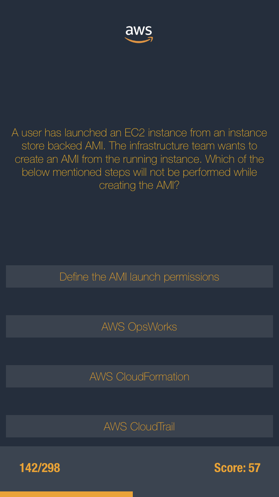

# AWS Quiz

Version 2.0 </br>

A Simple application that allows the user to review for AWS SYSOPS Certification.

## Getting Started

The user is provided with a question relating to the domain of AWS SYSOPS and is also provided with four options. The user has to click on the right option to go to the next question and to gain points. The user can also go to next question by pressing on the score and go to the previous question by pressing on the remaining question. As the user completes the questions the progress bar increases allowing the user to visualize how many question they have finished or how many questions are remaining.

## Launch Screen

The launch screen that is displayed while the user is waiting for the application to load.

```


```

## Question Screen

The question screen where the questions, choices, question number, score and the progress bar is displayed.

```


```

## Built With

* Xcode
* Swift 4.2
* Images from google and aws.

